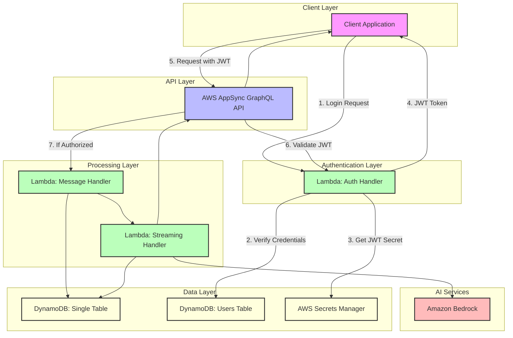
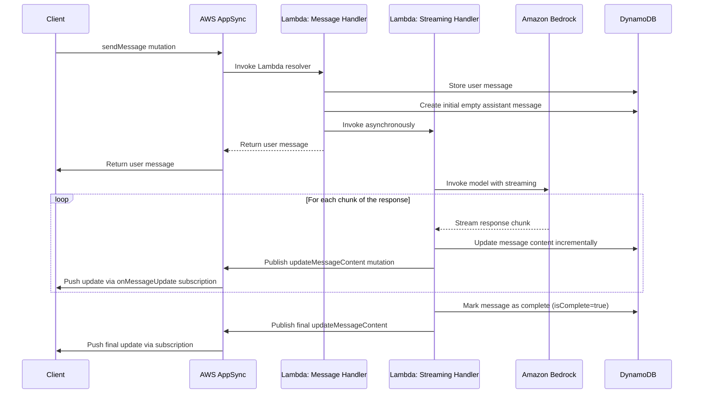
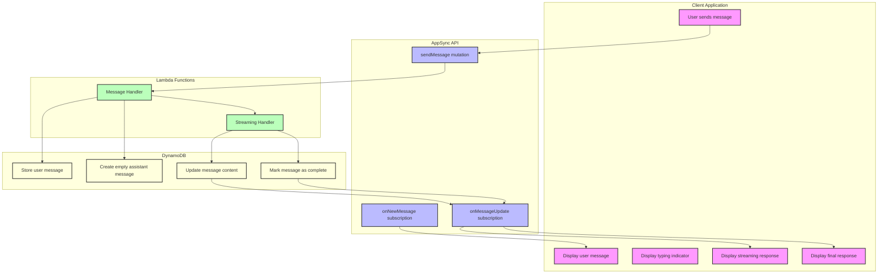

# AWS GenAI Chatbot with AppSync, Lambda, DynamoDB, Bedrock, and Terraform

This project demonstrates how to build a generative AI chatbot on AWS using AppSync, Lambda, DynamoDB, Amazon Bedrock, and Terraform. The architecture provides a scalable, serverless solution for creating AI-powered conversational experiences with real-time streaming responses.

## Architecture Overview

### System Architecture



The solution consists of the following components:

- **AWS AppSync**: Provides the GraphQL API layer with real-time capabilities and subscriptions
- **AWS Lambda**: Handles business logic, integration with Bedrock, and streaming responses
- **Amazon DynamoDB**: Stores chat history and conversation data
- **Amazon Bedrock**: Provides the foundation model for AI capabilities
- **Terraform**: Infrastructure as Code (IaC) for provisioning all resources
- **React Frontend**: User interface for interacting with the chatbot with real-time updates

## Key Features

### Real-time Streaming Responses

This chatbot implements a sophisticated streaming response mechanism that provides a more interactive user experience:

- **Incremental Updates**: AI responses appear word-by-word in real-time as they're generated
- **Subscription-based**: Uses AppSync subscriptions to push updates to the frontend
- **Optimized UX**: Provides immediate feedback to users while the AI is generating responses
- **Dedicated Lambda**: Uses a specialized streaming-handler Lambda function to process streaming responses from Bedrock

## Prerequisites

- AWS Account with appropriate permissions
- AWS CLI configured with access credentials
- Terraform (v1.2.0 or later)
- Node.js (v14 or later) and npm

## Project Structure

```
appsync-genai-terraform/
├── terraform/                  # Terraform configuration
│   ├── main.tf                 # Main Terraform configuration
│   ├── variables.tf            # Input variables
│   ├── outputs.tf              # Output values
│   ├── providers.tf            # Provider configuration
│   └── modules/                # Terraform modules
│       ├── appsync/            # AppSync module
│       ├── lambda/             # Lambda functions module
│       ├── dynamodb/           # DynamoDB module
│       └── iam/                # IAM roles and policies module
├── src/                        # Source code
│   ├── functions/              # Lambda functions
│   │   ├── message-handler/    # Message handling Lambda
│   │   └── streaming-handler/  # Streaming response handler Lambda
│   └── schema/                 # GraphQL schema
│       └── schema.graphql      # AppSync GraphQL schema
├── frontend/                   # React frontend application
│   ├── public/                 # Public assets
│   ├── src/                    # Frontend source code
│   │   ├── components/         # React components
│   │   ├── graphql/            # GraphQL operations and client
│   │   └── ...                 # Other frontend files
│   ├── package.json            # Frontend dependencies
│   └── README.md               # Frontend documentation
└── README.md                   # Project documentation
```

## Deployment Instructions

For detailed deployment instructions, please refer to the [Deployment Guide](deployment-guide.md).

1. **Clone the repository**

```bash
git clone https://github.com/yourusername/appsync-genai-terraform.git
cd appsync-genai-terraform
```

> **Note:** Replace `yourusername` with your actual GitHub username if you've forked this repository, or use the actual repository URL.

2. **Install dependencies for Lambda functions**

```bash
cd src/functions/message-handler
npm install
cd ../../..

cd src/functions/streaming-handler
npm install
cd ../../..

cd src/functions/auth-handler
npm install
cd ../../..
```

3. **Initialize Terraform**

```bash
cd terraform
terraform init
cd ..
```

4. **Deploy using the consolidated script**

```bash
# Standard deployment
./apply-changes.sh

# Deployment with frontend rebuild
./apply-changes.sh --build
```

This script will apply Terraform changes, update the frontend configuration, and restart the frontend application.

## Testing After Deployment

After deploying the infrastructure with Terraform, you have several options to test your AWS GenAI Chatbot:

### Option 1: Using the React Frontend (Recommended)

1. **Set up the frontend application**:

```bash
cd frontend
npm install
```

2. **Update the frontend configuration with Terraform outputs**:

```bash
node update-config.js ../terraform/terraform-output.json your-aws-region
```

3. **Start the frontend application**:

```bash
npm start
```

4. **Access the application** at http://localhost:3000 and start chatting with the AI.

### Option 2: Using the AWS AppSync Console

1. Log in to the AWS Management Console
2. Navigate to AWS AppSync
3. Find your API (the name is available in the Terraform output)
4. Go to the "Queries" section
5. Use the API key from Terraform output for authentication
6. Test GraphQL operations as described in the "Using the Chatbot" section below

### Option 3: Using Postman or Insomnia

1. Get the GraphQL endpoint URL and API key from Terraform outputs
2. Set up a new request in Postman/Insomnia:
   - Method: POST
   - URL: Your GraphQL endpoint
   - Headers:
     - `Content-Type: application/json`
     - `x-api-key: YOUR_API_KEY`
   - Body (JSON): Your GraphQL query or mutation

### Option 4: Using the test-api.sh Script

We've included a convenient bash script to test the API directly from the command line:

```bash
# Make the script executable (if not already)
chmod +x test-api.sh

# Run the script
./test-api.sh
```

This interactive script allows you to:
- Create new conversations
- List all conversations
- Send messages to the AI
- View messages in a conversation

The script requires `jq` to be installed for JSON processing.

### Option 5: Using AWS CLI for DynamoDB Testing

```bash
# List all items in the DynamoDB table
aws dynamodb scan --table-name $(terraform -chdir=terraform output -raw dynamodb_chatbot_data_table_name)

# List conversations (using the SK-PK-index GSI)
aws dynamodb query \
  --table-name $(terraform -chdir=terraform output -raw dynamodb_chatbot_data_table_name) \
  --index-name SK-PK-index \
  --key-condition-expression "SK = :metadata" \
  --expression-attribute-values '{":metadata": {"S": "METADATA"}}'

# List messages for a specific conversation
aws dynamodb query \
  --table-name $(terraform -chdir=terraform output -raw dynamodb_chatbot_data_table_name) \
  --key-condition-expression "PK = :pk AND begins_with(SK, :sk_prefix)" \
  --expression-attribute-values '{":pk": {"S": "CONV#YOUR_CONVERSATION_ID"}, ":sk_prefix": {"S": "MSG#"}}'
```

### Option 6: Using CloudWatch Logs for Debugging

1. Go to AWS CloudWatch in the console
2. Navigate to "Log groups"
3. Find logs for your Lambda functions:
   - `/aws/lambda/message-handler-function`
   - `/aws/lambda/streaming-handler-function`
4. Review logs for any errors or issues

## Using the Chatbot

The chatbot provides the following GraphQL operations:

- **Queries**:
  - `getMessage(id: ID!)`: Get a specific message by ID
  - `getConversation(id: ID!)`: Get a conversation by ID
  - `listConversations`: List all conversations
  - `getMessages(conversationId: ID!)`: Get all messages in a conversation

- **Mutations**:
  - `createConversation(title: String)`: Create a new conversation
  - `sendMessage(conversationId: ID!, content: String!)`: Send a message in a conversation
  - `updateMessageContent(messageId: ID!, conversationId: ID!, content: String!, isComplete: Boolean!)`: Update message content for streaming responses

- **Subscriptions**:
  - `onNewMessage(conversationId: ID!)`: Subscribe to new messages in a conversation
  - `onMessageUpdate(conversationId: ID!)`: Subscribe to streaming updates for a message

### Example Usage

1. Create a new conversation:

```graphql
mutation CreateConversation {
  createConversation(title: "My AI Chat") {
    id
    title
    createdAt
  }
}
```

2. Send a message:

```graphql
mutation SendMessage {
  sendMessage(
    conversationId: "CONVERSATION_ID",
    content: "Tell me about AWS AppSync"
  ) {
    id
    conversationId
    content
    role
    timestamp
    isComplete
  }
}
```

> **Note:** The `sendMessage` mutation returns only the user message. The assistant's response will be delivered through the `onNewMessage` and `onMessageUpdate` subscriptions.

3. Subscribe to new messages:

```graphql
subscription OnNewMessage {
  onNewMessage(conversationId: "CONVERSATION_ID") {
    id
    content
    role
    timestamp
  }
}
```

4. Subscribe to streaming message updates:

```graphql
subscription OnMessageUpdate {
  onMessageUpdate(conversationId: "CONVERSATION_ID") {
    messageId
    conversationId
    content
    isComplete
    timestamp
  }
}
```

### Testing Streaming Functionality

To test the streaming functionality:

1. Start the frontend application as described in the testing section
2. Create a new conversation
3. Send a message to the AI
4. Observe how the AI response appears word-by-word in real-time
5. The streaming continues until the complete response is generated

You can also test the streaming functionality using the AppSync Console:

1. Open the AppSync Console for your API
2. Subscribe to the `onMessageUpdate` subscription for a specific conversation
3. In another tab, send a message using the `sendMessage` mutation
4. Observe the streaming updates in the subscription tab

## Deploying the Frontend to Production

For production use, you can deploy the frontend to various hosting services:

### Option 1: AWS Amplify

1. Push your code to a Git repository
2. Set up a new Amplify app in the AWS Management Console
3. Connect your repository and follow the deployment steps

### Option 2: AWS S3 + CloudFront

1. Build the frontend: `cd frontend && npm run build`
2. Upload the contents of the `build` directory to an S3 bucket
3. Configure the bucket for static website hosting
4. (Optional) Set up CloudFront for CDN distribution

## Technical Implementation Details

For a detailed explanation of the implementation with code examples, see the [Simple Serverless AWS GenAI Chatbot Implementation Guide](implementation-details.md).

### GraphQL Schema

The project uses a GraphQL schema with the following key types:

```graphql
type Message {
  id: ID!
  conversationId: ID!
  content: String!
  role: String!  # "user" or "assistant"
  timestamp: AWSDateTime!
  isComplete: Boolean  # Tracks streaming completion status
}

type MessageUpdate {
  messageId: ID!
  conversationId: ID!
  content: String!
  isComplete: Boolean!
  timestamp: AWSDateTime!
}

type Subscription {
  onNewMessage(conversationId: ID!): Message
    @aws_subscribe(mutations: ["sendMessage"])
  
  onMessageUpdate(conversationId: ID!): MessageUpdate
    @aws_subscribe(mutations: ["updateMessageContent"])
}
```

The schema defines:
- A `Message` type with an `isComplete` flag to track streaming status
- A specialized `MessageUpdate` type for streaming updates
- Subscriptions for both new messages and streaming updates

### How Streaming Works

The streaming functionality is implemented through several components working together:

#### 1. Frontend Implementation

The React frontend uses Apollo Client to handle GraphQL operations and subscriptions. The implementation includes sophisticated handling of streaming responses:

```javascript
// Subscribe to streaming message updates
const { data: messageUpdateData } = useSubscription(ON_MESSAGE_UPDATE, {
  variables: { conversationId: conversation.id },
  onSubscriptionData: ({ subscriptionData, client }) => {
    const update = subscriptionData.data.onMessageUpdate;
    
    // Update our local state directly with the updated messages
    setMessages(prevMessages => {
      console.log('Previous messages in state:', prevMessages);
      
      // Create a map of message IDs to messages for easy lookup
      const messageMap = new Map();
      
      // First add all existing messages to the map
      prevMessages.forEach(msg => {
        // Skip placeholders that are being replaced
        if (msg.id.startsWith('placeholder-') && 
            uniqueMessages.some(m => m.role === 'assistant' && m.isComplete)) {
          console.log('Skipping placeholder in state merge:', msg.id);
          return;
        }
        messageMap.set(msg.id, msg);
      });
      
      // Then add or update with messages from the update
      if (update.messageId) {
        // Find existing message or create new one
        const existingMessage = Array.from(messageMap.values()).find(
          msg => msg.id === update.messageId || 
                (msg.role === 'assistant' && !msg.isComplete)
        );
        
        if (existingMessage) {
          // Update existing message
          messageMap.set(existingMessage.id, {
            ...existingMessage,
            id: update.messageId, // Ensure ID matches
            content: update.content,
            isComplete: update.isComplete
          });
        } else {
          // Create new message object
          messageMap.set(update.messageId, {
            id: update.messageId,
            conversationId: update.conversationId,
            content: update.content,
            role: 'assistant',
            timestamp: update.timestamp,
            isComplete: update.isComplete
          });
        }
      }
      
      // Convert back to array and sort by timestamp
      return Array.from(messageMap.values())
        .sort((a, b) => new Date(a.timestamp) - new Date(b.timestamp));
    });
  }
});
```

The frontend maintains a local state of messages and updates the UI in real-time as streaming chunks arrive. It includes sophisticated handling for:

- Placeholder messages while waiting for the first streaming chunk
- Message identification and matching
- Handling out-of-order updates
- Automatic scrolling to show new content
- Cache management with Apollo Client

#### 2. Message Handler Lambda

When a user sends a message, the Message Handler Lambda:

```javascript
async function sendMessage(conversationId, content) {
  // Store user message in DynamoDB
  const userMessage = { 
    id: uuidv4(), 
    conversationId, 
    content, 
    role: 'user', 
    timestamp: new Date().toISOString() 
  };
  await dynamodb.put({ TableName: MESSAGES_TABLE_NAME, Item: userMessage }).promise();
  
  // Create initial empty assistant message with isComplete=false
  const assistantMessageId = uuidv4();
  const assistantMessage = {
    id: assistantMessageId,
    conversationId,
    content: "...", // Initial placeholder
    role: 'assistant',
    timestamp: new Date().toISOString(),
    isComplete: false
  };
  await dynamodb.put({ TableName: MESSAGES_TABLE_NAME, Item: assistantMessage }).promise();
  
  // Invoke streaming handler asynchronously
  await lambda.invoke({
    FunctionName: process.env.STREAMING_HANDLER_FUNCTION,
    InvocationType: 'Event', // Asynchronous invocation
    Payload: JSON.stringify({
      messageId: assistantMessageId,
      conversationId,
      messages: conversationHistory,
      appsyncEndpoint,
      appsyncApiKey
    })
  }).promise();
  
  // Return both messages
  return { userMessage, assistantMessage };
}
```

Key technical aspects:
- Uses UUID v4 for generating unique message IDs
- Creates an initial placeholder message before streaming begins
- Asynchronously invokes the streaming handler to avoid blocking

#### 3. Streaming Handler Lambda

The Streaming Handler Lambda implements the streaming functionality using AWS SDK v3 for Bedrock:

```javascript
// Import AWS SDK v3 modules
const { BedrockRuntimeClient, InvokeModelWithResponseStreamCommand } = require('@aws-sdk/client-bedrock-runtime');
const { DynamoDBClient } = require('@aws-sdk/client-dynamodb');
const { DynamoDBDocumentClient, UpdateCommand } = require('@aws-sdk/lib-dynamodb');

// Initialize AWS clients
const region = process.env.AWS_REGION || 'us-east-1';
const bedrockClient = new BedrockRuntimeClient({ region });
const dynamoClient = new DynamoDBClient({ region });
const ddbDocClient = DynamoDBDocumentClient.from(dynamoClient);

// Invoke Bedrock model with streaming
const response = await bedrockClient.send(new InvokeModelWithResponseStreamCommand({
  modelId: BEDROCK_MODEL_ID,
  contentType: 'application/json',
  accept: 'application/json',
  body: JSON.stringify(requestBody)
}));

// Process streaming response using async iteration
let accumulatedContent = "";
for await (const chunk of response.body) {
  try {
    // Enhanced logging for chunk structure
    console.log('Chunk received:', chunk);
    
    // Extract bytes from the chunk
    if (chunk.chunk && chunk.chunk.bytes) {
      const chunkData = Buffer.from(chunk.chunk.bytes).toString('utf-8');
      const parsedData = JSON.parse(chunkData);
      
      // Check for content in the parsed data
      if (parsedData.type === 'content_block_delta' || parsedData.type === 'content_block_start') {
        if (parsedData.delta && parsedData.delta.text) {
          const tokenText = parsedData.delta.text;
          accumulatedContent += tokenText;
          
          // Update DynamoDB with incremental content
          await updateMessageInDynamoDB(messageId, accumulatedContent, false, conversationId);
          
          // Publish update to AppSync
          await publishToAppSync(messageId, conversationId, accumulatedContent, false, APPSYNC_ENDPOINT, APPSYNC_API_KEY);
        }
      }
    }
  } catch (error) {
    console.error('Error processing chunk:', error);
  }
}

// Mark as complete when done
await updateMessageInDynamoDB(messageId, accumulatedContent, true, conversationId);
await publishToAppSync(messageId, conversationId, accumulatedContent, true, APPSYNC_ENDPOINT, APPSYNC_API_KEY);
```

Technical implementation details:
- Uses AWS SDK v3 modules (`@aws-sdk/client-bedrock-runtime`, `@aws-sdk/client-dynamodb`, etc.)
- Uses `InvokeModelWithResponseStreamCommand` from AWS SDK v3 for Bedrock streaming
- Implements async iteration over the response stream
- Processes each chunk to extract text content from various response formats
- Includes robust error handling for each chunk
- Accumulates content incrementally
- Updates DynamoDB and publishes to AppSync after each chunk
- Verifies message existence in DynamoDB before publishing to AppSync

#### 4. AppSync Integration

The Streaming Handler Lambda publishes updates to AppSync using direct HTTP requests:

```javascript
async function publishToAppSync(messageId, conversationId, content, isComplete, appsyncEndpoint, appsyncApiKey) {
  // Prepare the mutation
  const mutation = `
    mutation UpdateMessageContent($messageId: ID!, $conversationId: ID!, $content: String!, $isComplete: Boolean!) {
      updateMessageContent(messageId: $messageId, conversationId: $conversationId, content: $content, isComplete: $isComplete) {
        messageId
        conversationId
        content
        isComplete
        timestamp
      }
    }
  `;
  
  const variables = { messageId, conversationId, content, isComplete };
  
  // Execute the mutation using HTTPS request
  const requestBody = JSON.stringify({ query: mutation, variables });
  const options = {
    method: 'POST',
    headers: {
      'Content-Type': 'application/json',
      'x-api-key': appsyncApiKey
    }
  };
  
  // Send the request to AppSync
  await makeHttpRequest(appsyncEndpoint, options, requestBody);
}
```

This mutation triggers the `onMessageUpdate` subscription, which delivers the update to all subscribed clients.

#### 5. DynamoDB Schema

The DynamoDB schema uses a single-table design to efficiently support all access patterns:

```
DynamoDB Schema:

- Table Name: CHATBOT_DATA
- Partition Key: PK (String) - Format: CONV#<conversationId>
- Sort Key: SK (String) - Format: METADATA or MSG#<messageId>
- GSI1 Hash Key: GSI1PK (String) - Format: MSG#<messageId>
- GSI1 Sort Key: GSI1SK (String) - Format: timestamp
- Attributes:
  - id (String)
  - conversationId (String)
  - content (String)
  - role (String)
  - timestamp (String)
  - isComplete (Boolean)
  - title (String)
  - createdAt (String)
  - updatedAt (String)
```

- **Single Table Design**:
  - Partition Key: `PK` (String) - Format: `CONV#<conversationId>`
  - Sort Key: `SK` (String) - Format: `METADATA` for conversation items or `MSG#<messageId>` for message items
  - Global Secondary Index (GSI1):
    - Hash Key: `GSI1PK` (String) - Format: `MSG#<messageId>`
    - Sort Key: `GSI1SK` (String) - Format: timestamp
    - Projection Type: ALL
    - Purpose: Enables efficient retrieval of messages by ID regardless of conversation
  - Global Secondary Index (SK-PK-index):
    - Hash Key: `SK` (String)
    - Sort Key: `PK` (String)
    - Projection Type: ALL
    - Purpose: Enables efficient listing of all conversations (by querying for SK="METADATA")
  - Billing Mode: On-demand (PAY_PER_REQUEST)

- **Item Types**:
  - **Conversation Items**:
    - PK: `CONV#<uuid>`
    - SK: `METADATA`
    - Attributes: id, title, createdAt, updatedAt
  
  - **Message Items**:
    - PK: `CONV#<conversationId>`
    - SK: `MSG#<uuid>`
    - GSI1PK: `MSG#<uuid>`
    - GSI1SK: timestamp
    - Attributes: id, conversationId, content, role, timestamp, isComplete

- **Access Patterns**:
  - Get conversation by ID: Query with `PK = "CONV#<id>"` and `SK = "METADATA"`
  - Get all messages for a conversation: Query with `PK = "CONV#<conversationId>"` and `SK` beginning with `"MSG#"`
  - Get message by ID: Query GSI1 with `GSI1PK = "MSG#<id>"`
  - List all conversations: Query SK-PK-index with `SK = "METADATA"`

Note: DynamoDB is schemaless for non-key attributes, meaning attributes like `content`, `role`, etc. are defined and managed at the application level rather than in the database schema itself.

#### 6. Complete Streaming Data Flow



The streaming data flow follows these steps:

1. User sends message via GraphQL mutation
2. AppSync invokes Message Handler Lambda
3. Message Handler:
   - Stores user message in DynamoDB
   - Creates empty assistant message with `isComplete=false`
   - Asynchronously invokes Streaming Handler
   - Returns to client immediately with the user message and empty assistant message

4. Streaming Handler:
   - Invokes Bedrock model with streaming enabled
   - For each chunk received:
     - Extracts text content
     - Accumulates content
     - Updates DynamoDB with current accumulated content
     - Publishes update to AppSync via GraphQL mutation

5. AppSync pushes updates to subscribed clients via WebSockets
6. Frontend receives updates and renders them in real-time
7. When streaming completes, message is marked as `isComplete=true`

#### 7. Subscription Flow



This diagram illustrates how the subscription flow works in the frontend application:

1. User sends a message which triggers the `sendMessage` mutation
2. The message handler processes the request and creates necessary database entries
3. The `onNewMessage` subscription delivers the user message to the client
4. The streaming handler processes the AI response in chunks
5. Each chunk update triggers the `onMessageUpdate` subscription
6. The client displays the streaming response in real-time
7. When the response is complete, the final update is delivered and displayed

### Terraform Infrastructure

The infrastructure is defined using Terraform modules:

- **AppSync Module**: Defines the GraphQL API, schema, resolvers, and API key
- **Lambda Module**: Defines the Lambda functions, IAM roles, and environment variables
- **DynamoDB Module**: Defines the DynamoDB tables, indexes, and capacity settings
- **IAM Module**: Defines the IAM roles and policies for the Lambda functions

The Terraform configuration uses AWS provider version 4.x and follows best practices for modularization and variable management.

## Customization

- **Bedrock Model**: You can change the Bedrock model by updating the `bedrock_model_id` variable in `terraform/variables.tf`.
- **Region**: Update the AWS region in `terraform/variables.tf`.
- **Table Configuration**: Modify the DynamoDB table settings in `terraform/modules/dynamodb/main.tf`.
- **Frontend Styling**: Customize the frontend appearance by modifying the CSS files in `frontend/src/components/`.
- **Streaming Behavior**: Adjust the streaming behavior by modifying the `streaming-handler/index.js` file.

## Authentication

This project includes a JWT-based authentication system with Lambda authorizers for AppSync and role-based access control. The authentication system secures both HTTP and WebSocket connections.

Key features:
- User authentication with JWT tokens
- Lambda authorizer for AppSync
- Multiple authentication methods (Lambda authorizer for users, IAM for services)
- Role-based access control
- Secure secret management with AWS Secrets Manager

### Demo Credentials

For testing, you can use these pre-configured accounts:

| Username | Password    | Role  |
|----------|-------------|-------|
| demo     | password123 | user  |
| admin    | admin123    | admin |

To seed these default users after deploying the infrastructure:

```bash
cd scripts
npm install
AWS_REGION=us-east-1 USERS_TABLE_NAME=$(cd ../terraform && terraform output -raw dynamodb_users_table_name) node seed-users.js
```

For detailed information about the authentication implementation, see the [Authentication Guide](authentication-guide.md).

## Cleanup

To remove all resources created by this project:

```bash
cd terraform
terraform destroy
```

## Security

See [CONTRIBUTING](CONTRIBUTING.md#security-issue-notifications) for more information.

## License

This library is licensed under the MIT-0 License. See the LICENSE file.
