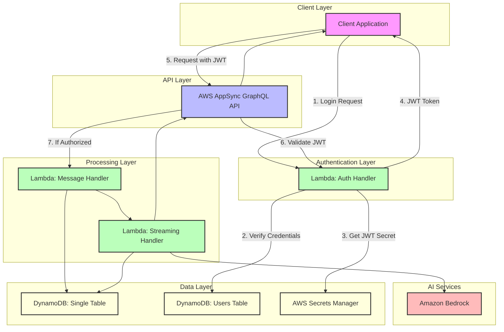

# AWS GenAI Chatbot with AppSync, Lambda, DynamoDB, Bedrock, and Terraform

This project demonstrates how to build a generative AI chatbot on AWS using AppSync, Lambda, DynamoDB, Amazon Bedrock, and Terraform. The architecture provides a scalable, serverless solution for creating AI-powered conversational experiences with real-time streaming responses.

## Documentation Guide

- **[README.md](README.md)**: Overview, architecture, and key features
- **[Architecture Diagrams](docs/architecture/architecture-diagram.md)**: Visual representations of system components and flows
- **[Deployment Guide](docs/guides/deployment-guide.md)**: Step-by-step deployment instructions
- **[Authentication Guide](docs/guides/authentication-guide.md)**: Details on the authentication system
- **[Data Modeling Guide](docs/guides/data-modeling.md)**: DynamoDB design patterns and access patterns
- **[Implementation Details](docs/guides/implementation-details.md)**: Technical implementation with code examples
- **[Contributing](CONTRIBUTING.md)**: Guidelines for contributing to this project
- **[Code of Conduct](CODE_OF_CONDUCT.md)**: Community standards and expectations

## Why This Project?

This project stands out from other GenAI chatbot implementations through several key innovations:

### 1. Real-Time Streaming with AppSync Subscriptions
Unlike many chatbot implementations that wait for complete responses, our solution delivers a true real-time experience:
- **Word-by-Word Streaming**: See AI responses appear in real-time as they're generated
- **WebSocket-Based**: Uses AppSync subscriptions for efficient real-time updates
- **Enhanced UX**: Provides immediate feedback and more natural conversation flow
- **Technical Innovation**: Combines AppSync subscriptions with Bedrock streaming in a novel architecture

### 2. Production-Ready Infrastructure
This isn't just a demo—it's built for real-world deployment:
- **Complete IaC**: Everything defined in Terraform, from Lambda functions to frontend hosting
- **Modular Design**: Clean separation of concerns through Terraform modules
- **Security-Focused**: Proper IAM permissions, secret management, and authentication
- **Deployment Pipeline**: Automated scripts for consistent deployments

### 3. Advanced DynamoDB Data Modeling
Our single-table design demonstrates DynamoDB best practices:
- **Optimized Access Patterns**: Efficient queries for all application needs
- **User Data Isolation**: Security built into the data model
- **Time-Based Sorting**: Sophisticated GSI design for conversation listing
- **Cost-Effective**: Minimizes read/write capacity needs through smart design

### 4. Enterprise-Grade Authentication
Beyond basic auth, our system provides:
- **JWT + Lambda Authorizer**: Secure token-based authentication
- **Multi-Auth Methods**: Support for both user authentication and service-to-service communication
- **Role-Based Access**: Granular permission control
- **WebSocket Security**: Properly secured real-time connections

### 5. Educational Value
This project serves as a comprehensive learning resource:
- **Detailed Documentation**: Clear explanations of complex concepts
- **Visual Architecture**: Diagrams illustrating system flow and interactions
- **Code Examples**: Well-commented implementation of advanced patterns
- **AWS Best Practices**: Demonstrates recommended approaches for production systems

## Architecture Overview

For detailed architecture diagrams, please see the [Architecture Diagrams](docs/architecture/architecture-diagram.md) document.

### System Architecture



The solution consists of the following components:

- **AWS AppSync**: Provides the GraphQL API layer with real-time capabilities and subscriptions
- **AWS Lambda**: Handles business logic, integration with Bedrock, and streaming responses
- **Amazon DynamoDB**: Stores chat history and conversation data
- **Amazon Bedrock**: Provides the foundation model for AI capabilities
- **Terraform**: Infrastructure as Code (IaC) for provisioning all resources
- **React Frontend**: User interface for interacting with the chatbot with real-time updates

## Key Features

### Real-time Streaming Responses

This chatbot implements a sophisticated streaming response mechanism that provides a more interactive user experience:

- **Incremental Updates**: AI responses appear word-by-word in real-time as they're generated
- **Subscription-based**: Uses AppSync subscriptions to push updates to the frontend
- **Optimized UX**: Provides immediate feedback to users while the AI is generating responses
- **Dedicated Lambda**: Uses a specialized streaming-handler Lambda function to process streaming responses from Bedrock

## Prerequisites

- AWS Account with appropriate permissions
- AWS CLI configured with access credentials
- Terraform (v1.2.0 or later)
- Node.js (v14 or later) and npm

## Project Structure

```
appsync-genai-terraform/
├── terraform/                  # Terraform configuration
│   ├── main.tf                 # Main Terraform configuration
│   ├── variables.tf            # Input variables
│   ├── outputs.tf              # Output values
│   ├── providers.tf            # Provider configuration
│   └── modules/                # Terraform modules
│       ├── appsync/            # AppSync module
│       ├── lambda/             # Lambda functions module
│       ├── dynamodb/           # DynamoDB module
│       └── iam/                # IAM roles and policies module
├── src/                        # Source code
│   ├── functions/              # Lambda functions
│   │   ├── message-handler/    # Message handling Lambda
│   │   └── streaming-handler/  # Streaming response handler Lambda
│   └── schema/                 # GraphQL schema
│       └── schema.graphql      # AppSync GraphQL schema
├── frontend/                   # React frontend application
│   ├── public/                 # Public assets
│   ├── src/                    # Frontend source code
│   │   ├── components/         # React components
│   │   ├── graphql/            # GraphQL operations and client
│   │   └── ...                 # Other frontend files
│   ├── package.json            # Frontend dependencies
│   └── README.md               # Frontend documentation
└── README.md                   # Project documentation
```

## Quick Start

For detailed deployment instructions, please refer to the [Deployment Guide](docs/guides/deployment-guide.md).

1. **Clone the repository**

```bash
git clone https://github.com/yourusername/appsync-genai-terraform.git
cd appsync-genai-terraform
```

2. **Deploy using the consolidated script**

```bash
# Standard deployment
./scripts/deployment/apply-changes.sh

# Deployment with frontend rebuild
./scripts/deployment/apply-changes.sh --build
```

This script will:
- Install dependencies for all Lambda functions
- Apply Terraform changes to update all infrastructure resources
- Update the frontend configuration
- Restart the frontend application

3. **Access the application** at http://localhost:3000 and start chatting with the AI.

## Testing After Deployment

After deploying the infrastructure with Terraform, you have two main options to test your AWS GenAI Chatbot:

### Option 1: Using the React Frontend (Recommended)

1. **Start the frontend application**:

```bash
cd frontend
npm start
```

2. **Access the application** at http://localhost:3000 and start chatting with the AI.

### Option 2: Using the AWS AppSync Console

1. Log in to the AWS Management Console
2. Navigate to AWS AppSync
3. Find your API (the name is available in the Terraform output)
4. Go to the "Queries" section
5. Use the API key from Terraform output for authentication
6. Test GraphQL operations as described in the "Using the Chatbot" section below

For advanced testing and debugging options, refer to the [Implementation Details](docs/guides/implementation-details.md) document. You can also use the testing scripts in the `scripts/testing/` directory.

## Using the Chatbot

The chatbot provides the following GraphQL operations:

- **Queries**:
  - `getMessage(id: ID!)`: Get a specific message by ID
  - `getConversation(id: ID!)`: Get a conversation by ID
  - `listConversations`: List all conversations
  - `getMessages(conversationId: ID!)`: Get all messages in a conversation

- **Mutations**:
  - `createConversation(title: String)`: Create a new conversation
  - `sendMessage(conversationId: ID!, content: String!)`: Send a message in a conversation
  - `updateMessageContent(messageId: ID!, conversationId: ID!, content: String!, isComplete: Boolean!)`: Update message content for streaming responses

- **Subscriptions**:
  - `onNewMessage(conversationId: ID!)`: Subscribe to new messages in a conversation
  - `onMessageUpdate(conversationId: ID!)`: Subscribe to streaming updates for a message

### Example Usage

1. Create a new conversation:

```graphql
mutation CreateConversation {
  createConversation(title: "My AI Chat") {
    id
    title
    createdAt
  }
}
```

2. Send a message:

```graphql
mutation SendMessage {
  sendMessage(
    conversationId: "CONVERSATION_ID",
    content: "Tell me about AWS AppSync"
  ) {
    id
    conversationId
    content
    role
    timestamp
    isComplete
  }
}
```

> **Note:** The `sendMessage` mutation returns only the user message. The assistant's response will be delivered through the `onNewMessage` and `onMessageUpdate` subscriptions.

3. Subscribe to streaming message updates:

```graphql
subscription OnMessageUpdate {
  onMessageUpdate(conversationId: "CONVERSATION_ID") {
    messageId
    conversationId
    content
    isComplete
    timestamp
  }
}
```

## Deploying the Frontend to Production

The frontend can be automatically deployed to AWS S3 and CloudFront using Terraform with enhanced security:

```bash
# Deploy the frontend
./scripts/deployment/deploy-frontend.sh
```

This will:
- Build the React application
- Update the configuration with Terraform outputs
- Upload the build files to S3
- Invalidate the CloudFront cache

The deployment includes these security features:
- Private S3 bucket with no public access
- CloudFront Origin Access Identity (OAI) for secure content delivery
- S3 bucket policy that only allows access from CloudFront
- Enhanced CloudFront configuration that supports WebSocket connections
- User-specific data access that ensures users can only access their own conversations and messages

After deployment, the frontend will be available at the CloudFront URL provided in the output.

## Technical Implementation Details

For a detailed explanation of the implementation with code examples, see the [Implementation Details](docs/guides/implementation-details.md) document.

For information about the DynamoDB data modeling approach, see the [Data Modeling Guide](docs/guides/data-modeling.md).

## Authentication

This project includes a JWT-based authentication system with Lambda authorizers for AppSync and role-based access control. The authentication system secures both HTTP and WebSocket connections.

Key features:
- User authentication with JWT tokens
- Lambda authorizer for AppSync
- Multiple authentication methods (Lambda authorizer for users, IAM for services)
- Role-based access control
- Secure secret management with AWS Secrets Manager

For detailed information about the authentication implementation, see the [Authentication Guide](docs/guides/authentication-guide.md).

### Demo Credentials

For testing, you can use these pre-configured accounts:

| Username | Password    | Role  |
|----------|-------------|-------|
| demo     | password123 | user  |
| admin    | admin123    | admin |

To seed these default users after deploying the infrastructure:

```bash
cd scripts
npm install
AWS_REGION=us-east-1 USERS_TABLE_NAME=$(cd ../terraform && terraform output -raw dynamodb_users_table_name) node seed-users.js
```

## Future Enhancements

The solution can be extended in several ways:
- Enhancing the authentication system with refresh tokens
- Implementing a mobile frontend
- Adding support for multiple AI models
- Enhancing the conversation context with additional metadata
- Adding RAG (Retrieval-Augmented Generation) capabilities
- Implementing tool use and function calling

## Cleanup

To remove all resources created by this project:

```bash
cd terraform
terraform destroy
```

## Security

See [CONTRIBUTING](CONTRIBUTING.md#security-issue-notifications) for more information.

## License

This library is licensed under the MIT-0 License. See the LICENSE file.
