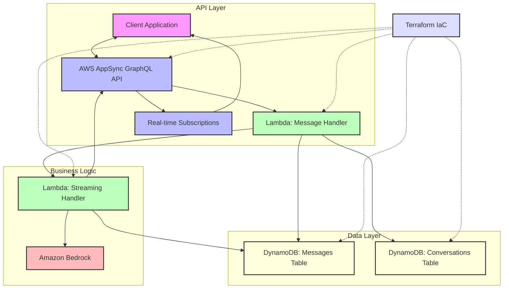
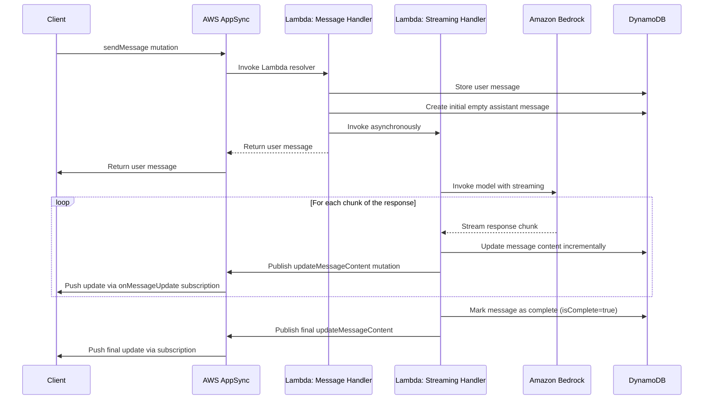
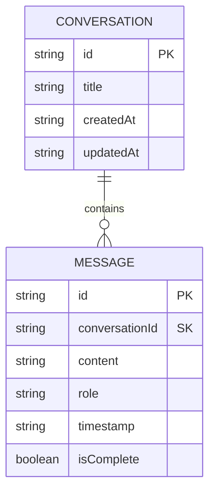
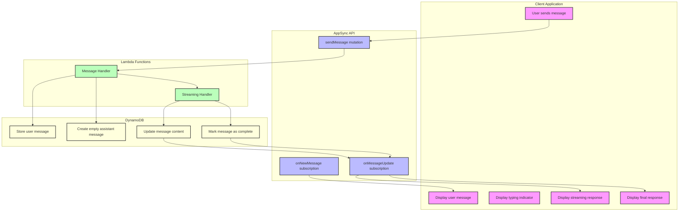

# AWS GenAI Chatbot Architecture

## System Architecture

```mermaid
flowchart TD
    Client[Client Application] <--> AppSync[AWS AppSync GraphQL API]
    
    subgraph "API Layer"
        AppSync --> MessageHandler[Lambda: Message Handler]
        AppSync --> Subscriptions[Real-time Subscriptions]
        Subscriptions --> Client
    end
    
    subgraph "Business Logic"
        MessageHandler --> StreamingHandler[Lambda: Streaming Handler]
        StreamingHandler --> Bedrock[Amazon Bedrock]
    end
    
    subgraph "Data Layer"
        MessageHandler --> MessagesTable[DynamoDB: Messages Table]
        MessageHandler --> ConversationsTable[DynamoDB: Conversations Table]
        StreamingHandler --> MessagesTable
    end
    
    StreamingHandler --> AppSync
    
    Terraform[Terraform IaC] -.-> AppSync
    Terraform -.-> MessageHandler
    Terraform -.-> StreamingHandler
    Terraform -.-> MessagesTable
    Terraform -.-> ConversationsTable
    
    style Client fill:#f9f,stroke:#333,stroke-width:2px
    style AppSync fill:#bbf,stroke:#333,stroke-width:2px
    style MessageHandler fill:#bfb,stroke:#333,stroke-width:2px
    style StreamingHandler fill:#bfb,stroke:#333,stroke-width:2px
    style Bedrock fill:#fbb,stroke:#333,stroke-width:2px
    style MessagesTable fill:#ffd,stroke:#333,stroke-width:2px
    style ConversationsTable fill:#ffd,stroke:#333,stroke-width:2px
    style Terraform fill:#ddf,stroke:#333,stroke-width:2px
    style Subscriptions fill:#bbf,stroke:#333,stroke-width:2px
```

## Data Flow

```mermaid
sequenceDiagram
    participant Client
    participant AppSync as AWS AppSync
    participant MessageHandler as Lambda: Message Handler
    participant StreamingHandler as Lambda: Streaming Handler
    participant Bedrock as Amazon Bedrock
    participant DynamoDB
    
    Client->>AppSync: sendMessage mutation
    AppSync->>MessageHandler: Invoke Lambda resolver
    MessageHandler->>DynamoDB: Store user message
    
    MessageHandler->>DynamoDB: Create initial empty assistant message
    MessageHandler->>StreamingHandler: Invoke asynchronously
    MessageHandler-->>AppSync: Return user message
    AppSync->>Client: Return user message
    
    StreamingHandler->>Bedrock: Invoke model with streaming
    
    loop For each chunk of the response
        Bedrock-->>StreamingHandler: Stream response chunk
        StreamingHandler->>DynamoDB: Update message content incrementally
        StreamingHandler->>AppSync: Publish updateMessageContent mutation
        AppSync->>Client: Push update via onMessageUpdate subscription
    end
    
    StreamingHandler->>DynamoDB: Mark message as complete (isComplete=true)
    StreamingHandler->>AppSync: Publish final updateMessageContent
    AppSync->>Client: Push final update via subscription
```

## DynamoDB Schema

```mermaid
erDiagram
    CONVERSATION {
        string id "PK"
        string title
        string createdAt
        string updatedAt
    }
    MESSAGE {
        string id "PK"
        string conversationId "SK"
        string content
        string role
        string timestamp
        boolean isComplete
    }
    CONVERSATION ||--o{ MESSAGE : contains
```

## Subscription Flow

```mermaid
flowchart TD
    subgraph "Client Application"
        UserMessage[User sends message]
        DisplayUserMessage[Display user message]
        DisplayTyping[Display typing indicator]
        DisplayStreamingResponse[Display streaming response]
        DisplayFinalResponse[Display final response]
    end
    
    subgraph "AppSync API"
        SendMessageMutation[sendMessage mutation]
        OnNewMessageSub[onNewMessage subscription]
        OnMessageUpdateSub[onMessageUpdate subscription]
    end
    
    subgraph "Lambda Functions"
        MessageHandler[Message Handler]
        StreamingHandler[Streaming Handler]
    end
    
    subgraph "DynamoDB"
        StoreUserMessage[Store user message]
        CreateEmptyResponse[Create empty assistant message]
        UpdateMessageContent[Update message content]
        MarkComplete[Mark message as complete]
    end
    
    UserMessage --> SendMessageMutation
    SendMessageMutation --> MessageHandler
    MessageHandler --> StoreUserMessage
    MessageHandler --> CreateEmptyResponse
    MessageHandler --> StreamingHandler
    
    OnNewMessageSub --> DisplayUserMessage
    
    StreamingHandler --> UpdateMessageContent
    UpdateMessageContent --> OnMessageUpdateSub
    OnMessageUpdateSub --> DisplayStreamingResponse
    
    StreamingHandler --> MarkComplete
    MarkComplete --> OnMessageUpdateSub
    OnMessageUpdateSub --> DisplayFinalResponse
    
    style UserMessage fill:#f9f,stroke:#333,stroke-width:2px
    style SendMessageMutation fill:#bbf,stroke:#333,stroke-width:2px
    style OnNewMessageSub fill:#bbf,stroke:#333,stroke-width:2px
    style OnMessageUpdateSub fill:#bbf,stroke:#333,stroke-width:2px
    style MessageHandler fill:#bfb,stroke:#333,stroke-width:2px
    style StreamingHandler fill:#bfb,stroke:#333,stroke-width:2px
    style StoreUserMessage fill:#ffd,stroke:#333,stroke-width:2px
    style CreateEmptyResponse fill:#ffd,stroke:#333,stroke-width:2px
    style UpdateMessageContent fill:#ffd,stroke:#333,stroke-width:2px
    style MarkComplete fill:#ffd,stroke:#333,stroke-width:2px
    style DisplayUserMessage fill:#f9f,stroke:#333,stroke-width:2px
    style DisplayTyping fill:#f9f,stroke:#333,stroke-width:2px
    style DisplayStreamingResponse fill:#f9f,stroke:#333,stroke-width:2px
    style DisplayFinalResponse fill:#f9f,stroke:#333,stroke-width:2px
```
