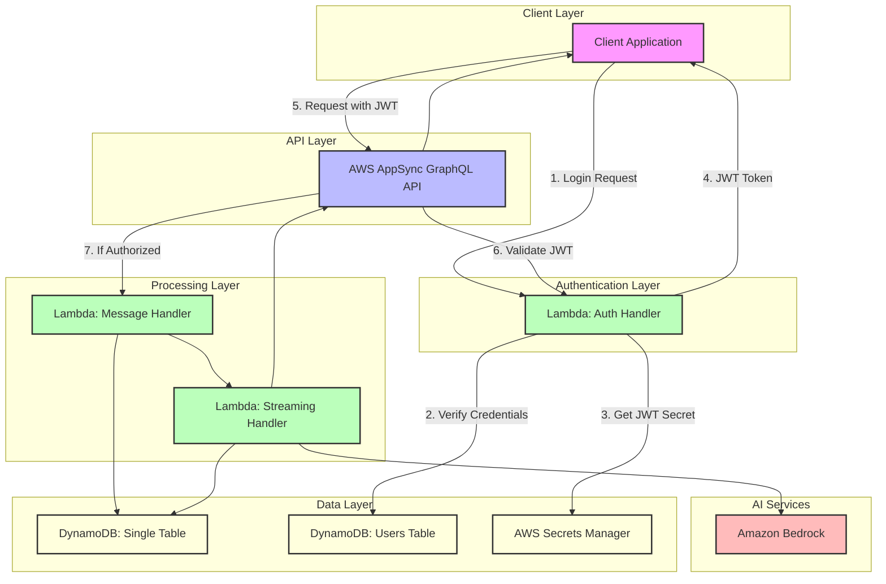
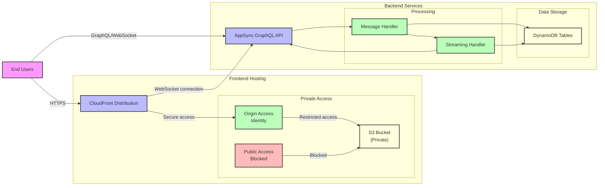
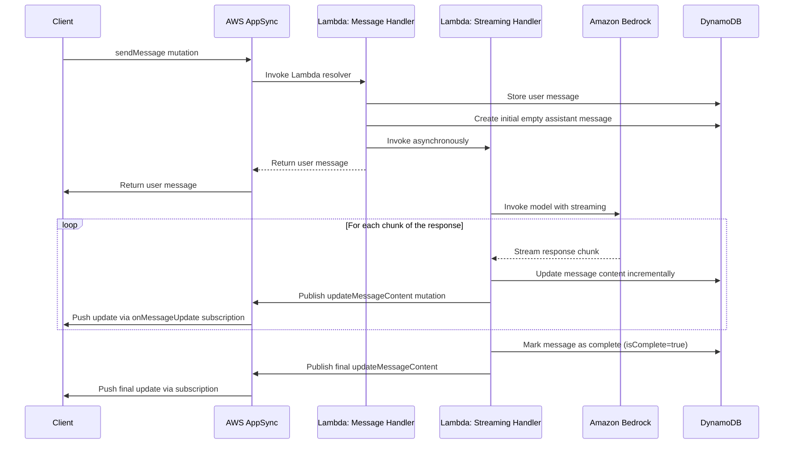
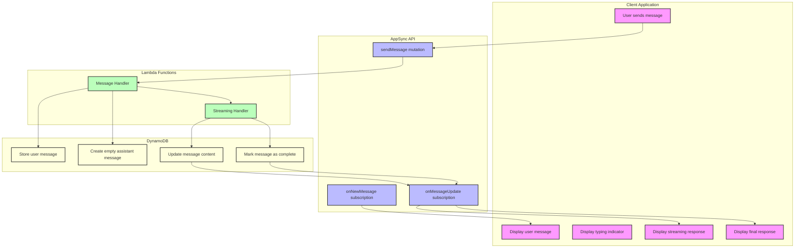
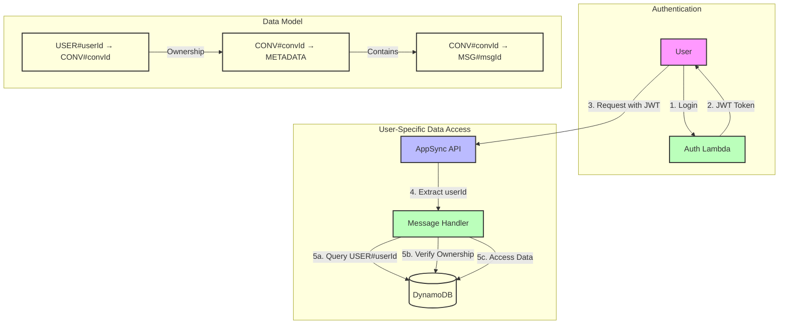

# AWS GenAI Chatbot Architecture Diagrams

This document contains the architecture diagrams for the AWS GenAI Chatbot project, illustrating the system components and their interactions.

## System Architecture Overview

## Secure Frontend Deployment Architecture

This diagram illustrates the secure frontend deployment architecture using S3 and CloudFront with Origin Access Identity (OAI).

## Streaming Data Flow

## Subscription Flow

## Data Access Security Model

This diagram illustrates how user-specific data access is enforced:

1. User authenticates and receives a JWT token
2. JWT token contains the user's ID
3. AppSync extracts the user ID from the JWT token
4. Message Handler uses the user ID to query only the user's conversations
5. Before accessing conversation data, ownership is verified
6. The data model links users directly to their conversations
