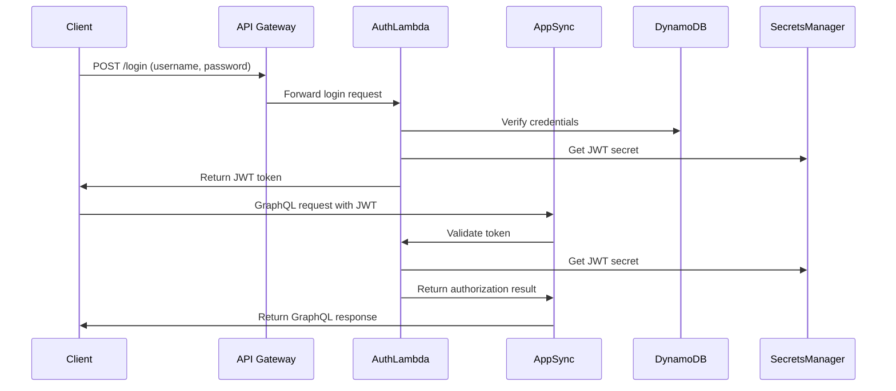

# Authentication Guide for AWS GenAI Chatbot

This document provides a comprehensive overview of the authentication system implemented in the AWS GenAI Chatbot project. The authentication system uses JWT tokens, AWS Lambda authorizers, and multiple authentication methods to secure both HTTP and WebSocket connections.

## Table of Contents

1. [Authentication Architecture](#authentication-architecture)
2. [Backend Components](#backend-components)
3. [Frontend Components](#frontend-components)
4. [Authentication Flows](#authentication-flows)
5. [Security Considerations](#security-considerations)
6. [User Management](#user-management)
7. [Troubleshooting](#troubleshooting)

## Authentication Architecture

The authentication system is built on the following principles:

- **JWT-based Authentication**: JSON Web Tokens (JWT) are used for stateless authentication
- **Multiple Authentication Methods**:
  - Lambda authorizer for user authentication (primary)
  - IAM authentication for service-to-service communication
- **Role-based Access Control**: Users can have different roles (e.g., user, admin)
- **Secure Secret Management**: JWT secrets are stored in AWS Secrets Manager

### Authentication Flow Diagram



## Backend Components

### Auth Handler Lambda Function

The Auth Handler Lambda function (`src/functions/auth-handler/index.js`) serves two primary purposes:

1. **Login Request Handling**: Authenticates users and issues JWT tokens
2. **Token Validation**: Validates JWT tokens for AppSync requests

Key features:

```javascript
// Handle both login requests and token validation
exports.handler = async (event) => {
  // Determine if this is an API Gateway event (login request) or AppSync authorizer event
  if (event.requestContext && event.requestContext.http) {
    // This is an API Gateway event (login request)
    return handleLogin(event);
  } else {
    // This is an AppSync authorizer event
    return handleAuthorization(event);
  }
};
```

#### Login Request Handling

The login process:

1. Verifies user credentials against DynamoDB
2. Uses bcrypt to compare password hashes
3. Generates a JWT token with user information
4. Returns the token to the client

```javascript
// Generate token (valid for 24 hours)
const token = jwt.sign(
  { 
    sub: username,
    username: username,
    email: user.email,
    roles: user.roles || ['user']
  },
  jwtSecret,
  { expiresIn: '24h' }
);
```

#### Token Validation

The token validation process:

1. Extracts the token from the Authorization header
2. Verifies the token signature using the JWT secret
3. Checks if the token is expired
4. Returns authorization result with user context

```javascript
// Extract token from Authorization header
const authHeader = event.authorizationToken;
if (!authHeader || !authHeader.startsWith('Bearer ')) {
  return { isAuthorized: false };
}

const token = authHeader.split(' ')[1];

// Verify the token
const decoded = jwt.verify(token, jwtSecret);
```

### JWT Secret Management

JWT secrets are securely stored in AWS Secrets Manager:

```javascript
async function getJwtSecret() {
  if (cachedJwtSecret) {
    return cachedJwtSecret;
  }
  
  try {
    const data = await secretsManager.getSecretValue({ SecretId: JWT_SECRET_ARN }).promise();
    const secretData = JSON.parse(data.SecretString);
    cachedJwtSecret = secretData.jwtSecret;
    return cachedJwtSecret;
  } catch (error) {
    console.error('Error retrieving JWT secret:', error);
    throw error;
  }
}
```

The secret is provisioned using Terraform:

```terraform
resource "aws_secretsmanager_secret" "jwt_secret" {
  name        = "${var.project_name}-${var.environment}-jwt-secret"
  description = "Secret key for JWT token signing"
}

resource "random_password" "jwt_secret" {
  length  = 32
  special = true
}

resource "aws_secretsmanager_secret_version" "jwt_secret_value" {
  secret_id     = aws_secretsmanager_secret.jwt_secret.id
  secret_string = jsonencode({
    jwtSecret = var.jwt_secret != null ? var.jwt_secret : random_password.jwt_secret.result
  })
}
```

### AppSync Configuration

The AppSync API is configured to use a Lambda authorizer as the primary authentication method, with IAM authentication as an additional method:

```terraform
# AppSync API
resource "aws_appsync_graphql_api" "chatbot_api" {
  name                = "${var.project_name}-api-${var.environment}"
  authentication_type = "AWS_LAMBDA"
  schema              = file("${path.module}/../../../src/schema/schema.graphql")

  lambda_authorizer_config {
    authorizer_uri = var.auth_lambda_function_arn
    identity_validation_expression = "Bearer .*"
  }

  # Add additional authentication provider for IAM
  additional_authentication_provider {
    authentication_type = "AWS_IAM"
  }

  log_config {
    cloudwatch_logs_role_arn = aws_iam_role.appsync_logs_role.arn
    field_log_level          = "ALL"
  }
}
```

The GraphQL schema uses directives to specify which operations require IAM authentication:

```graphql
type MessageUpdate @aws_iam {
  messageId: ID!
  conversationId: ID!
  content: String!
  isComplete: Boolean!
  timestamp: AWSDateTime!
}

type Mutation {
  sendMessage(conversationId: ID!, content: String!): Message
  createConversation(title: String): Conversation
  updateMessageContent(messageId: ID!, conversationId: ID!, content: String!, isComplete: Boolean!): MessageUpdate
    @aws_iam
}
```

## Frontend Components

### AuthService

The `authService.js` file (`frontend/src/auth/authService.js`) manages authentication state on the client side:

```javascript
class AuthService {
  /**
   * Login with username and password
   */
  async login(username, password) {
    // API call to login endpoint
    // Store token in localStorage
  }
  
  /**
   * Logout the current user
   */
  logout() {
    // Remove token from localStorage
  }
  
  /**
   * Get the current JWT token
   */
  getToken() {
    // Check token expiry
    // Return token or null
  }
  
  /**
   * Check if the user is logged in
   */
  isLoggedIn() {
    return !!this.getToken();
  }
  
  /**
   * Get the user roles
   */
  getRoles() {
    // Return roles from localStorage
  }
  
  /**
   * Check if the user has a specific role
   */
  hasRole(role) {
    // Check if user has the specified role
  }
}
```

### Protected Routes

The `PrivateRoute.js` component (`frontend/src/auth/PrivateRoute.js`) protects routes that require authentication:

```javascript
function PrivateRoute() {
  const isAuthenticated = authService.isLoggedIn();
  
  // If authenticated, render the child routes (Outlet)
  // Otherwise, redirect to the login page
  return isAuthenticated ? <Outlet /> : <Navigate to="/login" replace />;
}
```

### Login Component

The `Login.js` component (`frontend/src/components/Login.js`) provides the user interface for authentication:

```javascript
function Login() {
  const [username, setUsername] = useState('');
  const [password, setPassword] = useState('');
  
  const handleSubmit = async (e) => {
    e.preventDefault();
    
    try {
      await authService.login(username, password);
      navigate('/conversations'); // Redirect after login
    } catch (error) {
      setError(error.message || 'Invalid username or password');
    }
  };
  
  // Render login form
}
```

### GraphQL Client Configuration

The Apollo Client configuration (`frontend/src/graphql/client.js`) handles authentication for GraphQL operations:

```javascript
// Create an auth link that adds the JWT token to the Authorization header
const jwtAuthLink = setContext((_, { headers }) => {
  // Get the authentication token from the auth service
  const token = authService.getToken();
  
  // Return the headers to the context so httpLink can read them
  return {
    headers: {
      ...headers,
      authorization: token ? `Bearer ${token}` : '',
    }
  };
});

// Create a subscription link for real-time data
const subscriptionLink = createSubscriptionHandshakeLink({
  url: config.appSync.graphqlEndpoint,
  region: config.appSync.region,
  auth: {
    type: 'AWS_LAMBDA',
    token: authService.getToken() ? `Bearer ${authService.getToken()}` : '',
  },
});
```

## Authentication Flows

### Login Flow

1. User enters credentials in the login form
2. Frontend sends credentials to the API Gateway endpoint
3. Auth Lambda function verifies credentials against DynamoDB
4. If valid, Auth Lambda generates a JWT token using the secret from Secrets Manager
5. Token is returned to the frontend and stored in localStorage
6. User is redirected to the protected area of the application

### API Request Authentication

1. Frontend includes the JWT token in the Authorization header
2. AppSync forwards the token to the Auth Lambda authorizer
3. Auth Lambda verifies the token and returns authorization result
4. If authorized, AppSync processes the GraphQL operation
5. If not authorized, AppSync returns an authorization error

### WebSocket Authentication for Subscriptions

WebSocket connections for AppSync subscriptions require special handling:

1. Frontend creates a subscription link with the JWT token
2. Token must include the `Bearer` prefix to match Lambda authorizer expectations
3. AppSync validates the token using the Lambda authorizer
4. If valid, the WebSocket connection is established
5. Real-time updates are delivered through the subscription

## Security Considerations

### Password Security

- Passwords are hashed using bcrypt with a cost factor of 10
- Original passwords are never stored in the database
- Password comparison is done using bcrypt's compare function

```javascript
// Verify password with bcrypt
const passwordValid = await bcrypt.compare(password, user.passwordHash);
```

### JWT Token Security

- Tokens are signed using a secret stored in AWS Secrets Manager
- Tokens have a 24-hour expiration
- Token validation includes signature verification and expiration check
- Tokens include user roles for authorization

### Token Storage

- Tokens are stored in localStorage on the client side
- The frontend checks token expiration before using it
- Tokens are removed on logout

### Authorization Headers

- JWT tokens are sent in the Authorization header with the Bearer scheme
- The Lambda authorizer expects the Bearer prefix and validates accordingly

## User Management

### User Data Structure

Users are stored in DynamoDB with the following attributes:

- `username`: Primary key
- `email`: User's email address
- `passwordHash`: Bcrypt-hashed password
- `roles`: Array of role names (e.g., ['user', 'admin'])
- `createdAt`: Timestamp of user creation
- `lastLogin`: Timestamp of last successful login

### User Seeding

The project includes a script (`scripts/seed-users.js`) to create initial users:

```javascript
// Demo users to create
const users = [
  {
    username: 'demo',
    email: 'demo@example.com',
    password: 'password123',
    roles: ['user']
  },
  {
    username: 'admin',
    email: 'admin@example.com',
    password: 'admin123',
    roles: ['admin', 'user']
  }
];
```

To seed users:

```bash
cd scripts
npm install
AWS_REGION=us-east-1 USERS_TABLE_NAME=$(cd ../terraform && terraform output -raw dynamodb_users_table_name) node seed-users.js
```

### Role-Based Access Control

The authentication system supports role-based access control:

1. Roles are stored in the JWT token
2. The frontend can check roles using `authService.hasRole(role)`
3. The backend can check roles in the Lambda authorizer context

## Troubleshooting

### Common Authentication Issues

#### Invalid Credentials

If login fails with "Invalid credentials":
- Verify username and password
- Check if the user exists in the DynamoDB users table
- Ensure the password hash in DynamoDB matches the entered password

#### Token Validation Failures

If API requests fail with authorization errors:
- Check if the token is expired
- Verify the token format in the Authorization header
- Ensure the JWT secret in Secrets Manager matches the one used for signing

#### WebSocket Authentication Errors

If WebSocket connections fail with authentication errors:
- Ensure the subscription link is using the correct authentication type (`AWS_LAMBDA`)
- Verify the token includes the `Bearer` prefix
- Check the AppSync API configuration for authentication providers

### Debugging Authentication

1. Enable detailed logging in AppSync:
   ```terraform
   log_config {
     field_log_level = "ALL"
   }
   ```

2. Check CloudWatch logs for the Auth Lambda function

3. Use browser developer tools to inspect token storage and API requests

4. For WebSocket issues, refer to the [WebSocket Authentication Fix](websocket-auth-fix.md) document

## Additional Resources

- [AWS AppSync Authentication Types](https://docs.aws.amazon.com/appsync/latest/devguide/security-authz.html)
- [JWT.io](https://jwt.io/) - Useful for debugging JWT tokens
- [bcrypt Documentation](https://github.com/kelektiv/node.bcrypt.js)
- [AWS Secrets Manager Documentation](https://docs.aws.amazon.com/secretsmanager/latest/userguide/intro.html)
