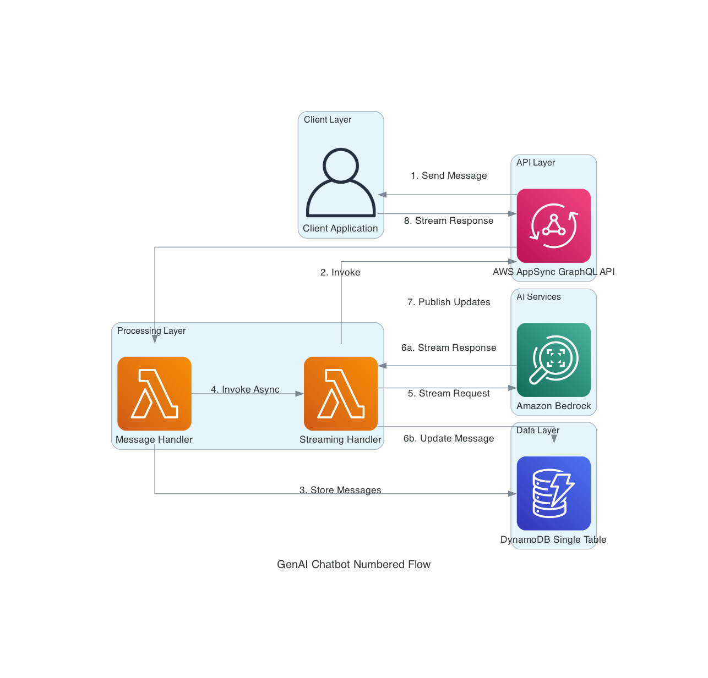

# Simple Serverless AWS GenAI Chatbot Implementation Guide

This document provides a detailed explanation of how this simple serverless architecture is implemented, with code examples showing each component's implementation and how data flows between them.

## Numbered Flow Diagram



The diagram above illustrates the complete flow of the GenAI Chatbot application, including both the authentication flow and conversation flow:

### Authentication Flow (Steps 1-7)
1. **Login Request**: Client sends login credentials to API Gateway
2. **Forward Request**: API Gateway forwards the request to Auth Lambda
3. **Verify Credentials**: Auth Lambda verifies credentials against Users Table
4. **Get JWT Secret**: Auth Lambda retrieves JWT secret from Secrets Manager
5. **Return JWT Token**: Auth Lambda returns JWT token to client
6. **Request with JWT**: Client includes JWT token in requests to AppSync
7. **Validate JWT**: AppSync validates JWT token with Auth Lambda

### Conversation Flow (Steps 8-14)
8. **If Authorized**: AppSync forwards authorized requests to Message Handler
9. **Store Messages**: Message Handler stores messages in DynamoDB
10. **Invoke Async**: Message Handler asynchronously invokes Streaming Handler
11. **Stream Request**: Streaming Handler sends request to Amazon Bedrock
12a. **Stream Response**: Bedrock streams response back to Streaming Handler
12b. **Update Message**: Streaming Handler updates message content in DynamoDB
13. **Publish Updates**: Streaming Handler publishes updates to AppSync
14. **Stream Response**: AppSync streams response to client

### Service-to-Service Authentication (Steps 15-16)
15. **IAM Auth**: Streaming Handler uses IAM authentication for service calls
16. **Authorize**: IAM authorizes the Streaming Handler to publish to AppSync

## Authentication Flow

The authentication system uses JWT tokens with a Lambda authorizer for secure access to the API:

### 1. Client → Auth Lambda: Login Request

User submits login credentials to the Auth Lambda via API Gateway:

```javascript
// In frontend code (frontend/src/auth/authService.js)
async login(username, password) {
  const response = await fetch(`${config.apiUrl}/login`, {
    method: 'POST',
    headers: {
      'Content-Type': 'application/json',
    },
    body: JSON.stringify({ username, password }),
  });
  
  const data = await response.json();
  
  // Store token in localStorage
  localStorage.setItem('token', data.token);
  localStorage.setItem('username', data.username);
  
  return data;
}
```

### 2. Auth Lambda → Users Table: Verify Credentials

Auth Lambda verifies the credentials against the Users DynamoDB table:

```javascript
// In auth-handler/index.js
// Get user from DynamoDB
const params = {
  TableName: USERS_TABLE,
  Key: { username }
};

const result = await dynamodb.get(params).promise();
const user = result.Item;

// Check if user exists and password is correct
if (!user || !bcrypt.compareSync(password, user.passwordHash)) {
  return {
    statusCode: 401,
    headers: { 'Content-Type': 'application/json' },
    body: JSON.stringify({ message: 'Invalid credentials' })
  };
}
```

### 3. Auth Lambda → Secrets Manager: Get JWT Secret

Auth Lambda retrieves the JWT secret from AWS Secrets Manager:

```javascript
// In auth-handler/index.js
async function getJwtSecret() {
  if (cachedJwtSecret) {
    return cachedJwtSecret;
  }
  
  const data = await secretsManager.getSecretValue({ SecretId: JWT_SECRET_ARN }).promise();
  cachedJwtSecret = JSON.parse(data.SecretString).jwtSecret;
  return cachedJwtSecret;
}
```

### 4. Auth Lambda → Client: JWT Token

Auth Lambda generates and returns a JWT token to the client:

```javascript
// In auth-handler/index.js
// Generate token (valid for 24 hours)
const token = jwt.sign(
  { 
    sub: username,
    username: username,
    email: user.email,
    roles: user.roles || ['user']
  },
  jwtSecret,
  { expiresIn: '24h' }
);

// Return success response with token
return {
  statusCode: 200,
  headers: {
    'Content-Type': 'application/json',
    'Access-Control-Allow-Origin': '*'
  },
  body: JSON.stringify({
    token,
    username,
    roles: user.roles,
    expiresIn: 86400 // 24 hours in seconds
  })
};
```

### 5. Client → AppSync: Request with JWT

Client includes the JWT token in the Authorization header for AppSync requests:

```javascript
// In frontend/src/graphql/client.js
const authLink = setContext((_, { headers }) => {
  // Get the token
  const token = authService.getToken();
  
  return {
    headers: {
      ...headers,
      authorization: token ? `Bearer ${token}` : "",
    }
  };
});
```

### 6. AppSync → Auth Lambda: Validate JWT

AppSync invokes the Auth Lambda to validate the JWT token:

```javascript
// In auth-handler/index.js
async function handleAuthorization(event) {
  try {
    // Extract token from Authorization header
    const authHeader = event.authorizationToken;
    if (!authHeader || !authHeader.startsWith('Bearer ')) {
      return { isAuthorized: false };
    }
    
    const token = authHeader.split(' ')[1];
    
    // Get JWT secret
    const jwtSecret = await getJwtSecret();
    
    // Verify the token
    const decoded = jwt.verify(token, jwtSecret);
    
    // Return authorization result with user context
    return {
      isAuthorized: true,
      resolverContext: {
        username: decoded.username,
        email: decoded.email,
        roles: decoded.roles || []
      }
    };
  } catch (error) {
    console.error('Authorization error:', error);
    return { isAuthorized: false };
  }
}
```

### 7. AppSync → Message Handler: If Authorized

If the token is valid, AppSync allows the request to proceed to the Message Handler Lambda.

## User-Specific Data Access

The application enforces user-specific data access to ensure users can only access their own conversations and messages:

### 1. Creating User-Specific Conversations

When a user creates a conversation, it's associated with their user ID:

```javascript
// In message-handler/index.js
async function createConversation(title, context) {
  const userId = context.identity.resolverContext.userId;
  const timestamp = new Date().toISOString();
  const id = uuidv4();
  
  // Create user-conversation mapping
  const userConversationItem = {
    PK: `USER#${userId}`,
    SK: `CONV#${id}`,
    id,
    userId,
    title: title || 'New Conversation',
    createdAt: timestamp,
    updatedAt: timestamp
  };
  
  // Create conversation metadata
  const conversationMetadataItem = {
    PK: `CONV#${id}`,
    SK: 'METADATA',
    id,
    userId,
    title: title || 'New Conversation',
    createdAt: timestamp,
    updatedAt: timestamp
  };
  
  // Write both items in a transaction
  await dynamodb.transactWrite({
    TransactItems: [
      { Put: { TableName: DYNAMODB_TABLE_NAME, Item: userConversationItem } },
      { Put: { TableName: DYNAMODB_TABLE_NAME, Item: conversationMetadataItem } }
    ]
  }).promise();
  
  return {
    id,
    userId,
    title: title || 'New Conversation',
    createdAt: timestamp,
    updatedAt: timestamp
  };
}
```

### 2. Listing User-Specific Conversations

Users can only see their own conversations:

```javascript
// In message-handler/index.js
async function listConversations(context) {
  const userId = context.identity.resolverContext.userId;
  
  const params = {
    TableName: DYNAMODB_TABLE_NAME,
    KeyConditionExpression: 'PK = :userId',
    ExpressionAttributeValues: {
      ':userId': `USER#${userId}`
    }
  };
  
  const result = await dynamodb.query(params).promise();
  
  return result.Items.map(item => ({
    id: item.id,
    userId: item.userId,
    title: item.title,
    createdAt: item.createdAt,
    updatedAt: item.updatedAt
  }));
}
```

### 3. Ownership Verification for Messages

Before accessing messages, the system verifies the user owns the conversation:

```javascript
// In message-handler/index.js
async function getMessages(conversationId, context) {
  const userId = context.identity.resolverContext.userId;
  
  // First verify ownership
  const userConvParams = {
    TableName: DYNAMODB_TABLE_NAME,
    Key: { 
      PK: `USER#${userId}`,
      SK: `CONV#${conversationId}`
    }
  };
  
  const userConvResult = await dynamodb.get(userConvParams).promise();
  if (!userConvResult.Item) {
    console.warn(`User ${userId} attempted to access messages for conversation ${conversationId} they don't own`);
    return []; // Return empty array for security
  }
  
  // Now get the messages
  // ...
}
```

## Conversation Flow Implementation Details

### 1. Client → AppSync: Send Message

User enters a message in the frontend application, which sends a GraphQL mutation to AppSync:

```javascript
// In frontend code (frontend/src/components/ChatInterface.js)
client.mutate({ 
  mutation: SEND_MESSAGE, 
  variables: { conversationId, content } 
});
```

This initiates the conversation flow with the AI assistant. The frontend uses Apollo Client to handle GraphQL operations and manages the local state of messages.

### 2. AppSync → Message Handler: Invoke

AppSync invokes the Message Handler Lambda function as a resolver:

```javascript
// In AppSync resolver configuration (terraform/modules/appsync/main.tf)
request_template = <<EOF
{
  "version": "2018-05-29",
  "operation": "Invoke",
  "payload": {
    "action": "sendMessage",
    "arguments": $util.toJson($context.arguments)
  }
}
EOF
```

The Lambda function is triggered synchronously, with AppSync waiting for a response. The resolver passes the user's message content and conversation ID to the Lambda function.

### 3. Message Handler → DynamoDB: Store Messages

Message Handler stores the user's message in DynamoDB and creates a new empty assistant message:

```javascript
// Store user message (src/functions/message-handler/index.js)
await dynamodb.put({
  TableName: DYNAMODB_TABLE_NAME,
  Item: userMessage
}).promise();

// Create empty assistant message
await dynamodb.put({
  TableName: DYNAMODB_TABLE_NAME,
  Item: assistantMessage
}).promise();
```

Both messages are stored using the single-table design pattern. The user message is stored with `role: 'user'` and the assistant message with `role: 'assistant'` and `isComplete: false`. The empty assistant message serves as a placeholder that will be updated incrementally during streaming.

### 4. Message Handler → Streaming Handler: Invoke Async

Message Handler asynchronously invokes the Streaming Handler Lambda:

```javascript
// In message-handler/index.js
const streamingParams = {
  FunctionName: process.env.STREAMING_HANDLER_FUNCTION,
  InvocationType: 'Event', // Asynchronous invocation
  Payload: JSON.stringify({
    messageId: assistantMessageId,
    conversationId,
    messages: conversationHistory,
    appsyncEndpoint,
    appsyncApiKey
  })
};

await lambda.invoke(streamingParams).promise();
```

The asynchronous invocation allows the Message Handler to return immediately without waiting for the AI response. It passes the message ID, conversation ID, conversation history, and AppSync details to the Streaming Handler.

### 5. Streaming Handler → Bedrock: Stream Request

Streaming Handler formats the conversation history for the Bedrock model and invokes it with streaming enabled:

```javascript
// In streaming-handler/index.js
const response = await bedrockClient.send(new InvokeModelWithResponseStreamCommand({
  modelId: BEDROCK_MODEL_ID,
  contentType: 'application/json',
  accept: 'application/json',
  body: JSON.stringify(requestBody)
}));
```

The Streaming Handler uses the AWS SDK v3 for Bedrock, specifically the `InvokeModelWithResponseStreamCommand` to initiate a streaming connection. This sets up the parameters and model configuration needed to receive chunks of the response as they're generated.

### 6a. Bedrock → Streaming Handler: Stream Response

Bedrock generates the AI response and streams it back in chunks:

```javascript
// In streaming-handler/index.js
for await (const chunk of response.body) {
  // Process streaming chunks
  if (chunk.chunk && chunk.chunk.bytes) {
    const chunkData = Buffer.from(chunk.chunk.bytes).toString('utf-8');
    try {
      const parsedData = JSON.parse(chunkData);
      
      // Check for content in the parsed data
      if (parsedData.type === 'content_block_delta' || parsedData.type === 'content_block_start') {
        if (parsedData.delta && parsedData.delta.text) {
          const tokenText = parsedData.delta.text;
          accumulatedContent += tokenText;
          
          // Update DynamoDB and AppSync with each chunk
          // ...
        }
      }
    } catch (parseError) {
      console.error('Error parsing chunk data:', parseError);
    }
  }
}
```

The Streaming Handler processes each chunk as it arrives, parsing the JSON data to extract the text content. It accumulates the content incrementally, building up the complete response over time.

### 6b. Streaming Handler → DynamoDB: Update Message

For each chunk received, Streaming Handler updates the assistant message in DynamoDB:

```javascript
// In streaming-handler/index.js
await updateMessageInDynamoDB(messageId, accumulatedContent, false, conversationId);

// Function implementation
async function updateMessageInDynamoDB(messageId, content, isComplete, conversationId) {
  await ddbDocClient.send(new UpdateCommand({
    TableName: DYNAMODB_TABLE_NAME,
    Key: { PK: `CONV#${conversationId}`, SK: `MSG#${messageId}` },
    UpdateExpression: 'SET content = :content, isComplete = :isComplete',
    ExpressionAttributeValues: { ':content': content, ':isComplete': isComplete }
  }));
}
```

The Streaming Handler incrementally appends the new content to the existing message and maintains the `isComplete: false` flag until streaming is complete. This creates a progressive record of the response as it's being generated.

### 7. Streaming Handler → AppSync: Publish Updates

For each chunk processed, Streaming Handler publishes an update to AppSync:

```javascript
// In streaming-handler/index.js
await publishToAppSync(messageId, conversationId, accumulatedContent, false, APPSYNC_ENDPOINT, APPSYNC_API_KEY);

// Function implementation uses HTTPS to call AppSync GraphQL endpoint
const mutation = `
  mutation UpdateMessageContent($messageId: ID!, $conversationId: ID!, $content: String!, $isComplete: Boolean!) {
    updateMessageContent(messageId: $messageId, conversationId: $conversationId, content: $content, isComplete: $isComplete) {
      messageId
      conversationId
      content
      isComplete
      timestamp
    }
  }
`;
```

The Streaming Handler uses a GraphQL mutation to publish the current state of the message, including the message ID, conversation ID, current content, and completion status. This triggers the subscription that delivers updates to the client.

### 8. AppSync → Client: Stream Response

AppSync pushes updates to subscribed clients via WebSockets:

```javascript
// In frontend/src/components/ChatInterface.js
const { data: messageUpdateData } = useSubscription(ON_MESSAGE_UPDATE, {
  variables: { conversationId: conversation.id },
  onSubscriptionData: ({ subscriptionData }) => {
    const update = subscriptionData.data.onMessageUpdate;
    // Update UI with streaming content
    setMessages(prevMessages => {
      // Find and update the message in the local state
      return prevMessages.map(msg => {
        if (msg.id === update.messageId) {
          return { ...msg, content: update.content, isComplete: update.isComplete };
        }
        return msg;
      });
    });
  }
});
```

The client receives incremental updates through the `onMessageUpdate` subscription and renders the streaming response in real-time as words appear. When streaming completes (`isComplete: true`), the frontend finalizes the message display.

## Completion Flow

When the streaming response is complete, the Streaming Handler marks the message as complete:

```javascript
// Mark as complete when done
await updateMessageInDynamoDB(messageId, accumulatedContent, true, conversationId);
await publishToAppSync(messageId, conversationId, accumulatedContent, true, APPSYNC_ENDPOINT, APPSYNC_API_KEY);
```

This final update sets `isComplete: true`, signaling to the frontend that the response is complete and no more updates will be coming for this message.

## Error Handling

The system includes robust error handling at each step:

1. **Message Handler**: If there's an error invoking the Streaming Handler, it updates the assistant message with an error message:

```javascript
try {
  await lambda.invoke(streamingParams).promise();
} catch (error) {
  console.error('Error invoking streaming handler:', error);
  
  // Update the message to indicate an error
  await updateMessageContent(
    assistantMessageId, 
    conversationId, 
    "Sorry, I encountered an error while generating a response. Please try again.", 
    true
  );
}
```

2. **Streaming Handler**: If there's an error processing the stream, it marks the message as complete with an error indicator:

```javascript
try {
  // Process streaming response
} catch (error) {
  console.error('Error processing stream:', error);
  
  // Mark as complete with error
  const errorMessage = accumulatedContent + "\n\n[Error: Processing interrupted]";
  await updateMessageInDynamoDB(messageId, errorMessage, true, conversationId);
  await publishToAppSync(messageId, conversationId, errorMessage, true, APPSYNC_ENDPOINT, APPSYNC_API_KEY);
}
```

3. **Frontend**: The frontend handles various error states, including network errors and timeouts:

```javascript
// Error handling in subscription
onError: (error) => {
  console.error('Subscription error:', error);
  setError('Error receiving updates. Please refresh the page.');
}
```

This comprehensive error handling ensures a robust user experience even when issues occur.
