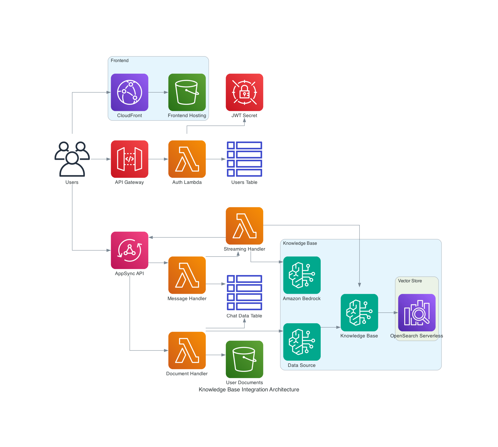
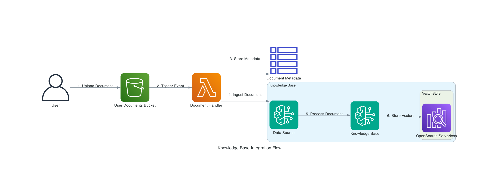

# Knowledge Base Integration Guide

This guide explains how the Amazon Bedrock Knowledge Base is integrated with the GenAI Chatbot application.

## Architecture Overview

The Knowledge Base integration consists of several components:

1. **Document Upload Interface**: Frontend components for uploading and managing documents
2. **Document Processing Lambda**: Processes uploaded documents and ingests them into the Knowledge Base
3. **Knowledge Base**: Amazon Bedrock Knowledge Base with OpenSearch Serverless as the vector store
4. **Retrieval Integration**: Integration with the chat interface to retrieve relevant information from the Knowledge Base



## Document Upload Flow

1. User uploads a document through the DocumentUpload component
2. Document is stored in the S3 bucket with a path structure: `user-documents/{userId}/{documentId}/original.{ext}`
3. S3 event triggers the document handler Lambda function
4. Lambda function processes the document and ingests it into the Knowledge Base
5. Document metadata is stored in DynamoDB with the document status



## Document Handler Lambda Function

The document handler Lambda function (`src/functions/document-handler/index.js`) is responsible for:

1. Processing S3 events for document uploads
2. Extracting document metadata
3. Ingesting documents into the Knowledge Base
4. Updating document status in DynamoDB

### S3 Data Source Ingestion

The function uses the `StartIngestionJobCommand` API to start an ingestion job for the S3 data source:

```javascript
const { StartIngestionJobCommand } = require('@aws-sdk/client-bedrock-agent');

async function startIngestionJob(documentId, userId, s3Key, documentMetadata) {
  if (!KNOWLEDGE_BASE_ID) {
    throw new Error('Knowledge Base ID not provided');
  }
  
  if (!KNOWLEDGE_BASE_DATA_SOURCE_ID) {
    throw new Error('Knowledge Base Data Source ID not provided');
  }
  
  console.log(`Ingesting document ${documentId} into Knowledge Base ${KNOWLEDGE_BASE_ID} with Data Source ${KNOWLEDGE_BASE_DATA_SOURCE_ID}`);
  
  // For S3 data sources, we need to use StartIngestionJob instead of IngestKnowledgeBaseDocuments
  // The S3 data source will automatically ingest documents from the S3 bucket based on the inclusion prefixes
  // We just need to start an ingestion job for the data source
  
  const ingestParams = {
    knowledgeBaseId: KNOWLEDGE_BASE_ID,
    dataSourceId: KNOWLEDGE_BASE_DATA_SOURCE_ID
  };
  
  console.log('Starting ingestion job with params:', JSON.stringify(ingestParams, null, 2));
  
  try {
    const command = new StartIngestionJobCommand(ingestParams);
    const response = await bedrockClient.send(command);
    console.log('Ingestion job started:', response);
    
    // Return the ingestion job ID
    return response.ingestionJobId || documentId;
  } catch (error) {
    console.error('Error starting ingestion job:', error);
    throw error;
  }
}
```

### Document Status Checking

The function also provides an endpoint to check the status of document processing:

```javascript
async function checkDocumentStatus(documentId, userId) {
  // Get document metadata
  const documentMetadata = await getDocumentMetadata(documentId, userId);
  
  // Check if document has an ingestion job ID
  if (documentMetadata.ingestionJobId) {
    const ingestionJobStatus = await checkIngestionJobStatus(documentMetadata.ingestionJobId);
    
    // Update document status based on ingestion job status
    if (ingestionJobStatus === 'COMPLETE') {
      await updateDocumentMetadata(documentId, userId, {
        status: 'PROCESSED',
        updatedAt: new Date().toISOString()
      });
      
      return {
        documentId,
        status: 'PROCESSED',
        message: 'Document processing completed'
      };
    } else if (ingestionJobStatus === 'FAILED') {
      // Handle failure
    } else {
      // Still processing
    }
  }
}
```

## Frontend Components

### Document Upload Component

The `DocumentUpload` component (`frontend/src/components/DocumentUpload.js`) allows users to upload documents to the application. It:

1. Provides a file input for selecting documents
2. Uploads the selected file to the S3 bucket
3. Creates a document record in DynamoDB
4. Shows the upload progress and status

### Document Library Component

The `DocumentLibrary` component (`frontend/src/components/DocumentLibrary.js`) displays the user's uploaded documents and their processing status. It:

1. Lists all documents uploaded by the user
2. Shows the document status (UPLOADING, PROCESSING, PROCESSED, FAILED)
3. Allows users to delete documents
4. Provides a link to view document details

### Document Selector Component

The `DocumentSelector` component (`frontend/src/components/DocumentSelector.js`) allows users to select documents to include in their chat context. It:

1. Lists all processed documents
2. Allows users to select/deselect documents
3. Passes the selected document IDs to the chat interface

## Chat Integration

The streaming handler Lambda function (`src/functions/streaming-handler/index.js`) integrates the Knowledge Base with the chat interface:

1. When a user sends a message, the function determines if Knowledge Base retrieval is needed
2. If retrieval is needed, it queries the Knowledge Base with the user's message
3. Retrieved documents are included in the context provided to the LLM
4. The LLM generates a response that incorporates information from the documents
5. The response includes citations to the source documents

### Retrieval Configuration

The retrieval configuration in the streaming handler:

```javascript
// Retrieve relevant documents from the Knowledge Base
async function retrieveFromKnowledgeBase(query, userId, selectedDocumentIds) {
  if (!KNOWLEDGE_BASE_ID) {
    console.log('No Knowledge Base ID provided, skipping retrieval');
    return [];
  }
  
  console.log(`Retrieving from Knowledge Base for query: ${query}`);
  
  // Build filter based on user ID and selected document IDs
  const filter = {
    andAll: [
      {
        equals: {
          key: 'userId',
          value: userId
        }
      }
    ]
  };
  
  // Add document ID filter if specific documents are selected
  if (selectedDocumentIds && selectedDocumentIds.length > 0) {
    filter.andAll.push({
      inAll: {
        key: 'documentId',
        values: selectedDocumentIds
      }
    });
  }
  
  const params = {
    knowledgeBaseId: KNOWLEDGE_BASE_ID,
    retrievalQuery: {
      text: query
    },
    retrievalConfiguration: {
      vectorSearchConfiguration: {
        numberOfResults: 5,
        filter: filter
      }
    }
  };
  
  const command = new RetrieveCommand(params);
  const response = await bedrockAgentClient.send(command);
  return response.retrievalResults || [];
}
```

## GraphQL Schema

The GraphQL schema (`src/schema/schema.graphql`) includes types and operations for document management:

```graphql
type Document {
  documentId: ID!
  userId: ID!
  documentName: String!
  documentType: String!
  size: Int
  status: DocumentStatus!
  createdAt: String!
  updatedAt: String
}

enum DocumentStatus {
  UPLOADING
  PROCESSING
  PROCESSED
  FAILED
}

type Mutation {
  createDocument(input: CreateDocumentInput!): Document!
  deleteDocument(documentId: ID!): Boolean!
  processDocument(documentId: ID!): Document!
}

type Query {
  getDocument(documentId: ID!): Document
  listDocuments: [Document]!
}
```

## Terraform Configuration and Deployment

The Knowledge Base deployment involves a two-step process:

1. First, the OpenSearch Serverless collection is provisioned using Terraform:

```hcl
# OpenSearch Serverless Collection for the Knowledge Base
resource "aws_opensearchserverless_collection" "kb_collection" {
  name       = local.kb_collection_name
  type       = "VECTORSEARCH"
  description = "OpenSearch Serverless Collection for Knowledge Base"
  
  # Add explicit dependency on the security policies
  depends_on = [
    aws_opensearchserverless_security_policy.kb_security_policy,
    aws_opensearchserverless_security_policy.kb_network_policy
  ]
}
```

2. After the collection is active, a script creates the vector index with the required mappings:

```bash
# From scripts/deployment/create-opensearch-index-cli.sh
INDEX_MAPPING_FILE=$(mktemp)
cat > $INDEX_MAPPING_FILE << 'EOF'
{
  "mappings": {
    "properties": {
      "bedrock-knowledge-base-default-vector": {
        "type": "knn_vector",
        "dimension": 1536,
        "method": {
          "name": "hnsw",
          "space_type": "l2",
          "engine": "faiss",
          "parameters": {
            "ef_construction": 512,
            "m": 16
          }
        }
      },
      "AMAZON_BEDROCK_TEXT_CHUNK": {
        "type": "text"
      },
      "AMAZON_BEDROCK_METADATA": {
        "type": "text"
      }
    }
  }
}
EOF
```

3. Finally, the Bedrock Knowledge Base is created using Terraform:

```hcl
# Amazon Bedrock Knowledge Base
resource "aws_bedrockagent_knowledge_base" "document_kb" {
  count = var.create_knowledge_base ? 1 : 0
  
  name        = "${var.project_name}-knowledge-base-${var.environment}"
  description = "Knowledge Base for user documents"
  role_arn    = aws_iam_role.bedrock_kb_role.arn

  knowledge_base_configuration {
    type = "VECTOR"
    vector_knowledge_base_configuration {
      embedding_model_arn = var.embedding_model_arn
    }
  }

  storage_configuration {
    type = "OPENSEARCH_SERVERLESS"
    opensearch_serverless_configuration {
      collection_arn    = aws_opensearchserverless_collection.kb_collection.arn
      vector_index_name = "bedrock-knowledge-base-default-index"
      field_mapping {
        vector_field   = "bedrock-knowledge-base-default-vector"
        text_field     = "AMAZON_BEDROCK_TEXT_CHUNK"
        metadata_field = "AMAZON_BEDROCK_METADATA"
      }
    }
  }
}
```

This two-step process is necessary because:
- OpenSearch Serverless collections take time to become active (5-10 minutes)
- The vector index needs to be created with specific mappings before the Knowledge Base can use it
- The Knowledge Base creation will fail if it references a non-existent index

The deployment is automated using the script `scripts/deployment/apply-changes.sh --create-kb`, which handles both creating the vector index and deploying the Knowledge Base.

## IAM Permissions

The IAM permissions required for the Knowledge Base integration are defined in `terraform/modules/iam/main.tf`:

```hcl
# Policy for Lambda to access Bedrock
resource "aws_iam_policy" "lambda_bedrock_policy" {
  policy = jsonencode({
    Statement = [
      {
        Action = [
          "bedrock:InvokeModel",
          "bedrock:InvokeModelWithResponseStream"
        ]
        Effect   = "Allow"
        Resource = "*"
      },
      {
        Action = [
          "bedrock:StartIngestionJob",
          "bedrock:GetIngestionJob",
          "bedrock:ListIngestionJobs",
          "bedrock:Retrieve",
          "bedrock:IngestKnowledgeBaseDocuments",
          "bedrock:GetKnowledgeBase",
          "bedrock:ListKnowledgeBases"
        ]
        Effect   = "Allow"
        Resource = "*"
      }
    ]
  })
}
```

## Best Practices

1. **Document Chunking**: The Knowledge Base automatically chunks documents into smaller pieces for better retrieval. The default chunking strategy works well for most documents, but you may need to customize it for specific use cases.

2. **Metadata Filtering**: Always include user ID in the metadata to ensure users can only access their own documents.

3. **Error Handling**: Implement robust error handling for document processing and retrieval to provide a good user experience.

4. **Status Monitoring**: Regularly check the status of document processing to ensure documents are being ingested correctly.

5. **Performance Optimization**: Monitor the performance of Knowledge Base retrieval and adjust the number of results and other parameters as needed.

## Troubleshooting

1. **Document Not Found**: If a document is not being retrieved, check that it was successfully ingested into the Knowledge Base and that the metadata filters are correct.

2. **Slow Retrieval**: If retrieval is slow, consider reducing the number of results or optimizing the query.

3. **Irrelevant Results**: If the results are not relevant to the query, try adjusting the retrieval parameters or improving the query formulation.

4. **Permission Errors**: If you encounter permission errors, check that the IAM roles have the necessary permissions for the Bedrock Knowledge Base API operations.
